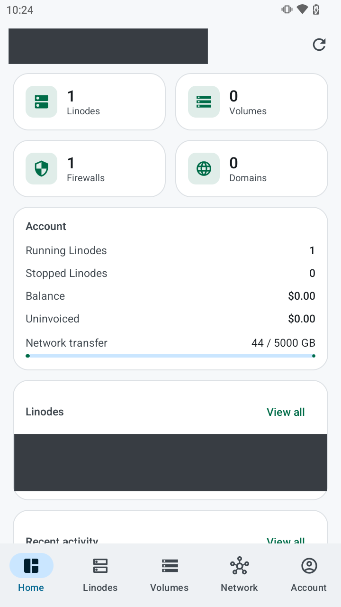
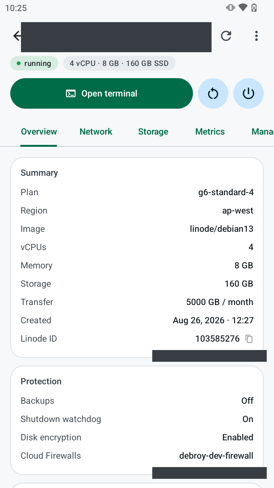
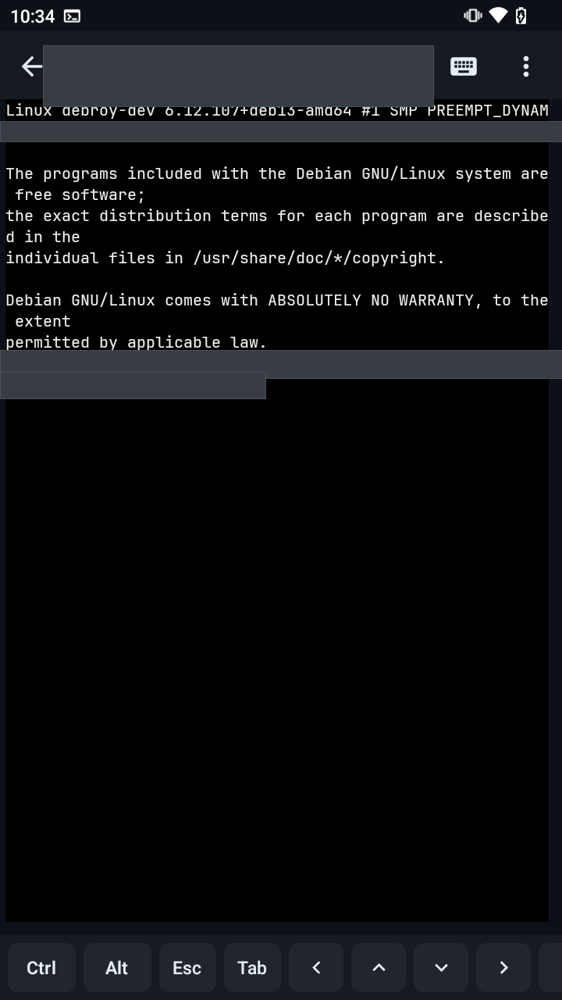
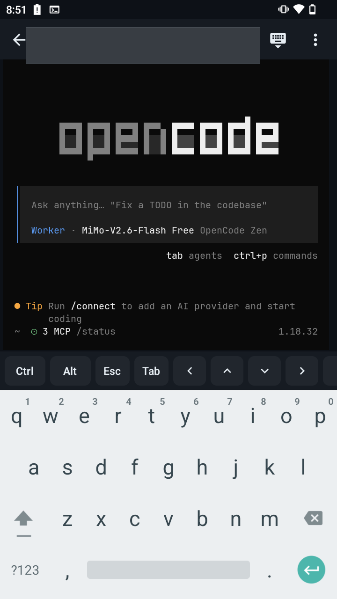

  

<h1 align="center">Linode Manager</h1>

  

  Manage your Akamai Cloud (Linode) infrastructure from an Android phone — and open a real SSH terminal into any Linode.

  
  
  
  

## Highlights

- **Your whole account on a phone** — Linodes (power, resize, rebuild, rename, snapshots, backups, create), Block Storage volumes, Cloud Firewalls with a full rule editor, DNS domains, NodeBalancers, Kubernetes (LKE), billing, invoices, SSH keys and activity.
- **A real terminal** — built on ConnectBot's SSH and terminal libraries (libvterm): type straight into the shell, pinch to zoom, select and copy, colours, and full-screen TUIs such as vim, htop, **opencode** and **Claude Code**.
- **Sessions that survive a phone** — terminals keep running when you switch apps or lock the screen, notice a dead mobile connection within about 30 seconds, reconnect automatically and can live inside **tmux** or **[herdr](https://herdr.dev)** so work continues on the server.
- **Safe by default** — the API token and SSH private keys are stored encrypted on the device; host keys are verified; every destructive action asks first, and deletes require typing the resource name.
- **Works on any Android 8+ phone** — consistent layout on small phones, large phones and tablets (navigation rail), light and dark themes.

## Install

1. Download the latest APK from **[Releases](https://github.com/debakarr/linode-manager/releases/latest)**:
   - `…-arm64-v8a.apk` — almost every phone from the last ~8 years
   - `…-universal.apk` — works everywhere (larger download)
2. Open it on the phone and allow installing from your browser/file manager if Android asks.

Updates install over the previous version and keep your sign-in, keys and settings.

## Quick start

1. **Create an API token** — Cloud Manager → your profile → **API Tokens** → *Create a Personal Access Token*. Give it the scopes you want the app to use (read-only scopes are enough for browsing).
2. **Sign in** — paste the token into the app. It's verified against the API and stored encrypted on this device only.
3. **Open a terminal** — Linodes → pick one → **Open terminal**. Generate a device key first (Account → SSH keys → *Generate*) and add its public key to the server. See the **[SSH & terminal guide](docs/SSH.md)**.

## Documentation

| Guide | What's in it |
|---|---|
| [User guide](docs/USER_GUIDE.md) | Every screen: Home, Linodes, create flow, volumes, network, account, appearance |
| [SSH & terminal](docs/SSH.md) | Keys, first connection, extra keys, tmux & herdr, file upload, background sessions, troubleshooting |
| [Architecture](docs/ARCHITECTURE.md) | How the app is put together: API layer, SSH stack, crypto policy, session lifecycle, UI system |
| [Development](docs/DEVELOPMENT.md) | Building, signing, the test suites, screenshots, releasing |
| [Changelog](CHANGELOG.md) | What changed in every release |

## Privacy & security

- The app talks **only** to `api.linode.com` (with your token) and to the servers you SSH into. There is no backend, analytics or tracking.
- Token, device SSH private keys and trusted host keys are stored with Android's encrypted storage (AES-256, keys in the Android Keystore). On the rare device without a working Keystore the app falls back to its private storage, which other apps can't read.
- Host keys are trusted on first use and **refused if they change** (possible man-in-the-middle).
- Revoke a token any time in Cloud Manager → API Tokens.

## Tech

Kotlin, Jetpack Compose + Material 3, Retrofit/OkHttp, ConnectBot **sshlib** (SSH/SFTP) and **termlib** (libvterm terminal), JetBrains Mono (bundled terminal font, SIL OFL 1.1). Min Android 8.0 (API 26), targets API 37.

## License & credits

Terminal and SSH engines: [ConnectBot sshlib](https://github.com/connectbot/sshlib) and [termlib](https://github.com/connectbot/termlib) (Apache 2.0). Terminal font: [JetBrains Mono](https://github.com/JetBrains/JetBrainsMono) (SIL Open Font License 1.1, licence shipped in `app/src/main/assets/licenses/`). Not affiliated with Akamai Technologies or Linode.
