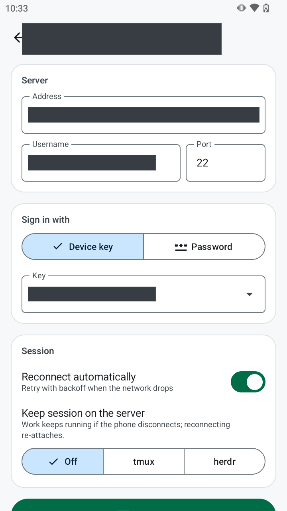
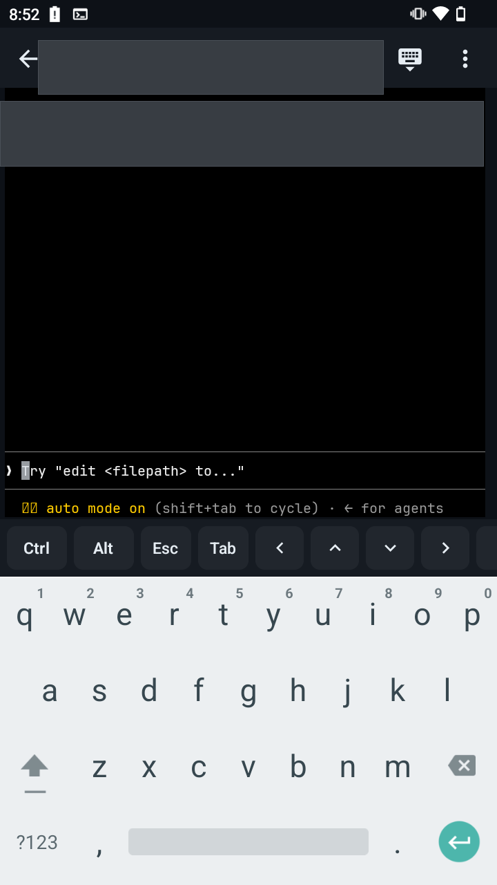
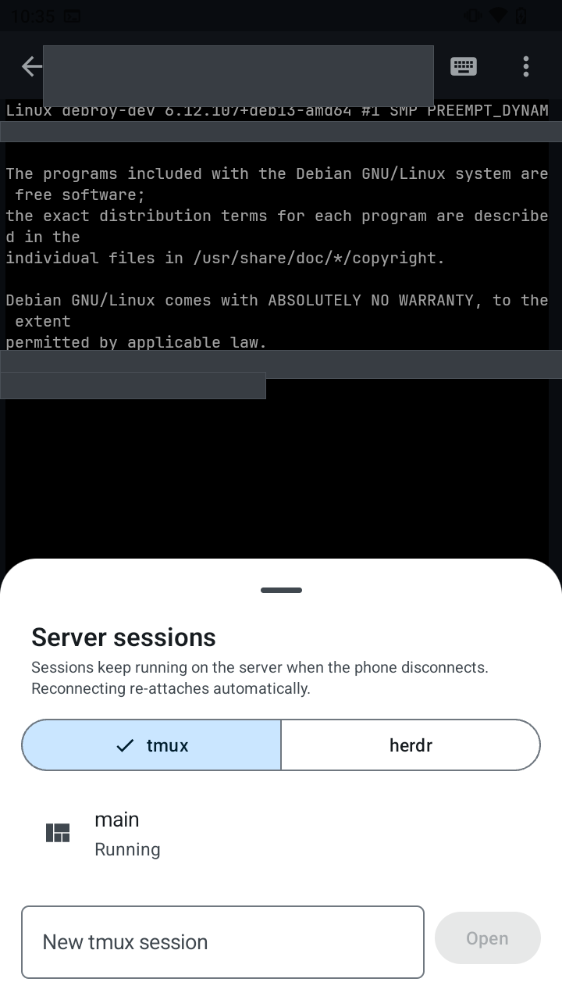
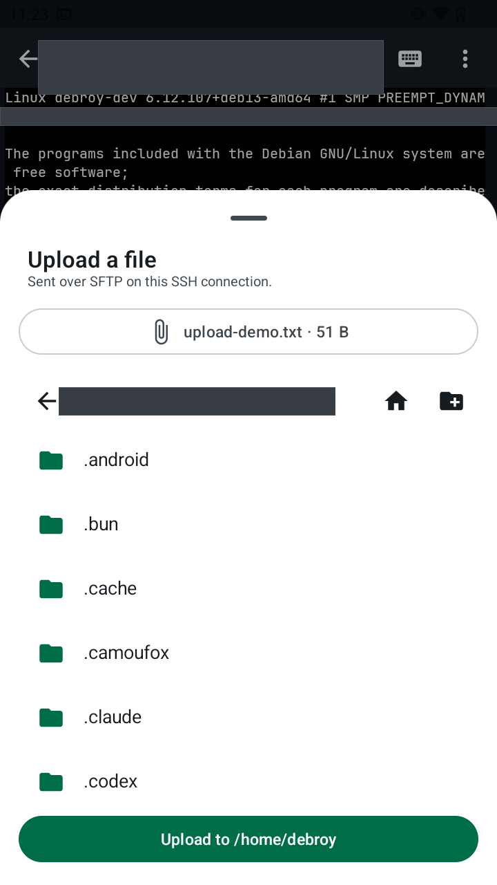
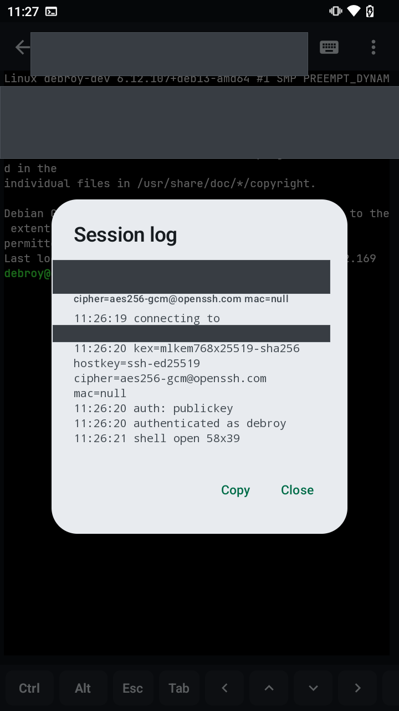

# SSH & terminal guide

Open a real terminal into any Linode from its detail screen: **Linodes → a Linode → Open terminal**.

- [1. Set up a key (once)](#1-set-up-a-key-once)
- [2. Connect](#2-connect)
- [3. Trust the server (first time)](#3-trust-the-server-first-time)
- [Using the terminal](#using-the-terminal)
- [tmux or herdr: keep work running on the server](#tmux-or-herdr-keep-work-running-on-the-server)
- [Uploading files](#uploading-files)
- [Background sessions, drops and reconnects](#background-sessions-drops-and-reconnects)
- [Security details](#security-details)
- [Troubleshooting](#troubleshooting)

---

## 1. Set up a key (once)

Many servers — including hardened Linodes — only accept **key** logins. The app creates a key on the phone; you give the *public* half to the server.

1. **Account → SSH keys on this device → Generate.** A 3072-bit RSA key is created and stored encrypted on the phone. The private key never leaves it.
2. Get the **public key** onto the server, one of:
   - **New Linodes:** key **⋮ → Upload to Linode profile**, then tick it under *Access* when [creating a Linode](USER_GUIDE.md#creating-a-linode).
   - **Existing Linodes:** key **⋮ → Copy public key**, then append it on the server (e.g. via Lish or an existing SSH session):
     ```bash
     mkdir -p ~/.ssh && chmod 700 ~/.ssh
     echo 'ssh-rsa AAAA… your-key-label' >> ~/.ssh/authorized_keys
     chmod 600 ~/.ssh/authorized_keys
     ```
     Do this for the user you'll log in as (`root`, or your own user).

Password logins work too if the server allows them (`PasswordAuthentication yes` in `sshd_config`).

## 2. Connect



| Field | Notes |
|---|---|
| **Address** | The Linode's addresses. With more than one (IPv4 + IPv6) this is a picker of the addresses the API reports; with a single address it's a free-text field where you can also type a hostname. |
| **Username / Port** | Default `root` / `22`. |
| **Sign in with** | *Device key* (pick which) or *Password*. Passwords are kept in memory for reconnects only — never saved. |
| **Reconnect automatically** | Retries with backoff when the connection drops. |
| **Keep session on the server** | *Off*, *tmux* or *herdr*, plus a session name — see [tmux or herdr](#tmux-or-herdr-keep-work-running-on-the-server). |

These settings are remembered per Linode (except the password). On Android 13+ the app asks once for notification permission so it can show the *SSH connected* notification; the terminal works either way.

<br clear="right">

## 3. Trust the server (first time)

The first connection shows the server's **host key fingerprint**. Compare it with the server's own before tapping **Trust & connect** — for example in Lish:

```bash
ssh-keygen -lf /etc/ssh/ssh_host_ed25519_key.pub
```

After that, the key is pinned. If the server ever presents a **different** key, the app refuses to connect and warns about a possible man-in-the-middle attack (or a rebuilt Linode — see [Troubleshooting](#troubleshooting)).

<br clear="right">

## Using the terminal


- **Type** directly — tap the terminal to bring up the keyboard; ⌨ in the top bar shows/hides it.
- **Zoom** — pinch in or out.
- **Select & copy** — long-press, drag the handles, copy.
- **Links** — tap a hyperlink a program emits (OSC 8 links, e.g. from `ls --hyperlink`) to open it. Plain URLs in text aren't tappable; select and copy them instead.
- **Paste** — the *Paste* key at the end of the extra-keys bar, or the ⋮ menu. When the program supports bracketed paste (bash, zsh, vim, most TUIs), a multi-line paste arrives as one block instead of running line by line.

**Extra keys** (above the keyboard; scroll sideways for more):

| Key | Use |
|---|---|
| **Ctrl**, **Alt** | Sticky: tap once = applies to the next key (on the bar *or* the keyboard), tap again = locked, third tap = off. E.g. **Ctrl** then `c` = interrupt. |
| **Esc**, **Tab** | As on a keyboard (Tab completes in shells). |
| **← ↑ ↓ →** | Cursor keys: history, menus, editors. |
| `\|` `/` `-` `~` | Symbols that are awkward on phone keyboards. |
| **Home End PgUp PgDn** | Navigation in pagers and editors. |

**Top-bar menu (⋮):** Paste · Upload file · Server sessions · Lock landscape / portrait · Session log · Disconnect / Reconnect · Close session.

<br clear="right">


### Full-screen apps (opencode, Claude Code, vim, htop…)

These work as on a desktop terminal: colours, mouse-free menus, arrow-key navigation, `Esc`, `Ctrl+…` shortcuts and alternate-screen apps that restore your shell when they exit.

- **opencode** — `Ctrl` then `p` opens the command palette; `/exit` quits.
- **Claude Code** — arrow keys move through choices, Enter confirms, `Esc` cancels; `Shift+Tab` isn't on the bar, so use Claude's `/` commands instead where possible.
- Rotate to **landscape** (or lock it from the menu) for a wider terminal.

<br clear="right">



The terminal uses a bundled **JetBrains Mono** font, so columns line up on every phone, including those with custom system fonts. A few symbols that font doesn't have (some emoji and braille spinners) come from the phone's own fonts; if the phone lacks them too they show as boxes.

<br clear="right">

## tmux or herdr: keep work running on the server



Under **Keep session on the server**, choose **tmux** or **herdr** and a session name. The terminal then runs inside that session: it attaches if the session exists and creates it otherwise. If the connection drops — or you close the terminal — everything inside keeps running on the server, and reconnecting drops you straight back in.

- **⋮ → Server sessions** lists the server's tmux or herdr sessions (switch at the top). Tap one to switch to it, or type a name and **Open** to create a new one.
- **Detach** leaves the session running and drops you to a normal shell.
- If the tool isn't installed on the server, you get a normal shell and a one-line notice.

<br clear="right">

### tmux

The app runs `tmux new-session -A -s <name>`. tmux's prefix is **Ctrl** then `b` on the extra-keys bar, followed by the tmux key (e.g. `c` new window, `n` next window, `d` detach). Install with `apt install tmux`.

### herdr

[herdr](https://herdr.dev) is a terminal workspace manager for AI coding agents. The app runs `herdr --session <name>` (it looks in `~/.local/bin`, where herdr's installer puts it). On a phone-sized screen herdr switches to its compact layout.

herdr is designed to be used with a mouse, but **the app's terminal doesn't send taps as mouse clicks**, so drive it with its keyboard shortcuts: tap **Ctrl**, then `b` (herdr's prefix), then the key:

| Keys | Action |
|---|---|
| Ctrl, b, `c` | New tab |
| Ctrl, b, `n` / `p` | Next / previous tab |
| Ctrl, b, `1`…`9` | Go to tab |
| Ctrl, b, `w` | Workspace picker |
| Ctrl, b, `b` | Show / hide the sidebar |
| Ctrl, b, `v` / `-` | Split the pane vertically / horizontally |
| Ctrl, b, `h` `j` `k` `l` | Move between panes |
| Ctrl, b, `z` | Zoom the current pane |
| Ctrl, b, `q` | Detach (herdr keeps running) |
| Ctrl, b, `?` | herdr's help |

These are herdr's defaults; if you've customised keys in `~/.config/herdr/config.toml`, use yours. Your desktop and the phone can be attached to the same herdr session.

## Uploading files



**⋮ → Upload file** sends a file from the phone over SFTP on the same connection (no second login):

1. **Choose a file on this phone.**
2. Browse to the destination folder — ⌂ goes to your home folder, ← to the parent, 📁+ creates a folder.
3. **Upload.** You're warned if a file with the same name will be replaced.

Progress shows over the terminal, so you can close the sheet and keep working; **Cancel** stops the transfer.

<br clear="right">

<br clear="right">

## Background sessions, drops and reconnects

- **Back** leaves the terminal but **keeps the session running**. Return via the Linode (*Resume terminal*), the *Terminals* card on Home, or the notification.
- While a session is open, a notification (*SSH connected · …*) keeps Android from killing it in the background. **Disconnect all** in the notification closes every session.
- Every 15 seconds the app checks the connection is alive; if the server doesn't answer within 12 seconds, the link is treated as dead. Switching networks (Wi-Fi ↔ mobile) triggers an immediate check.
- With *Reconnect automatically*, drops are retried after 2, 4, 8, 16, then every 30 seconds (up to 30 attempts). A banner shows the countdown with **Retry now** / **Stop**; a `── reconnected ──` line marks where the new connection starts. tmux and herdr sessions are re-attached.
- Typing `exit` ends the session normally — no reconnect.
- **Disconnect** keeps the screen so you can **Reconnect** later; **Close session** discards it.
- **Session log** (⋮) shows the negotiated encryption and a timeline of connection events. **Copy** it when reporting a problem.



The first lines are the negotiated algorithms — here a post-quantum key exchange
(`mlkem768x25519-sha256`) with `aes256-gcm@openssh.com`. Below them is the
connection timeline: connect, key exchange, authentication, shell open. If a
session drops, this is the first thing to copy into a bug report.

<br clear="right">

## Security details

- **Host keys** are trusted on first use and pinned per `host[:port]`; a changed key is refused.
- **Encryption:** AES-256-GCM / AES-128-GCM, falling back to AES-CTR with SHA-2 MACs. Key exchange prefers the post-quantum hybrid `mlkem768x25519-sha256` and falls back to `curve25519-sha256` if the phone's crypto provider can't do it. `chacha20-poly1305` is deliberately not offered: with Android's Conscrypt provider it fails integrity checks (the cause of the old *MAC incorrect* disconnects in v1.x).
- **Keys:** device private keys are stored encrypted on the phone. The app only ever shows, copies or uploads the public key — there is no way to export the private key.
- **Passwords** are held in memory for the life of the session and never written to storage.

## Troubleshooting

| Message / symptom | What to do |
|---|---|
| *Connection timed out* | The port is blocked or the Linode is off. Check the Linode is running and that its **Cloud Firewall** allows the port (22, or your custom port). |
| *Connection refused* | Nothing is listening on that port — is `sshd` running? Right port? |
| *Password login is disabled on this server — use a key* | Set up a [device key](#1-set-up-a-key-once), or enable `PasswordAuthentication` on the server. |
| *The server rejected this key* | The public key isn't in `~/.ssh/authorized_keys` for **that username**, or file permissions are too open (`chmod 600 ~/.ssh/authorized_keys`, `chmod 700 ~/.ssh`). |
| *The host key for this server changed* | Expected after **rebuilding** a Linode (new host keys). Otherwise, don't connect — something may be intercepting. To accept a legitimate new key today you must clear the app's storage (Android Settings → Apps → Linode Manager → Storage → Clear storage), which also signs you out and removes device keys. |
| Session dies when the phone is locked | Some phones (Xiaomi/MIUI, Samsung, Huawei…) kill background apps aggressively. Allow the app to run in the background: Settings → Apps → Linode Manager → Battery → **No restrictions** (and *Autostart* on Xiaomi). |
| No *SSH connected* notification | Notifications were denied. Allow them in Android Settings → Apps → Linode Manager → Notifications. The terminal still works. |
| Text looks spaced out (`p e r m i t`) | Fixed in v2.0.3 — update the app. |
| Symbols show as boxes (□) | Neither the bundled font nor the phone has that symbol (some emoji/spinners). Harmless. |
